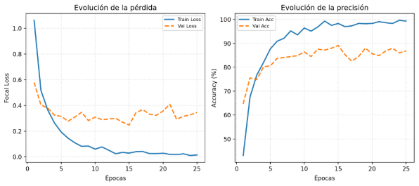
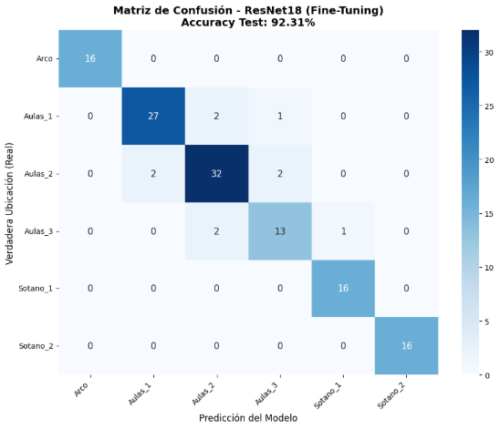

Informe de proyecto: UAO-Finder

**Resumen:** Este informe presenta el diseño y evaluación de una aplicación móvil orientada a facilitar la ubicación de estudiantes y visitantes dentro del campus de la Universidad Autónoma de Occidente. El sistema propone el uso de procesamiento digital de imágenes y aprendizaje profundo para reconocer la ubicación actual del usuario a partir de fotografías capturadas con la cámara del celular. Para ello, se empleó una arquitectura ResNet-18 ajustada mediante transferencia de aprendizaje sobre un dataset propio de imágenes RGB del campus. El conjunto de entrenamiento más reciente estuvo conformado por 1.291 imágenes distribuidas en seis clases: Arco, Aulas 1, Aulas 2, Aulas 3, Sótano 1 y Sótano 2. El modelo alcanzó una precisión final de 92,31% sobre el conjunto de prueba, lo que demuestra la viabilidad del enfoque para apoyar procesos de navegación interna. A partir de la ubicación clasificada por el modelo, la aplicación puede ofrecer una ruta hacia un destino seleccionado mediante algoritmos de camino mínimo como Dijkstra o A\*.

**Palabras clave:** aplicación móvil, visión computacional, ResNet-18, clasificación de imágenes, navegación interna, UAO, procesamiento digital de imágenes.
# I. INTRODUCCIÓN
La orientación dentro de un campus universitario puede convertirse en una dificultad para estudiantes nuevos, visitantes o personas que no conocen completamente la distribución de los espacios. En este contexto, el proyecto propone una aplicación móvil capaz de reconocer la ubicación del usuario mediante una imagen tomada con la cámara del celular. A partir de esa clasificación, el sistema puede mostrar una ruta hacia un destino dentro de la Universidad Autónoma de Occidente.

El valor principal de la propuesta está en transformar el entorno físico del campus en un sistema interpretable por medio del celular. En lugar de depender únicamente de mapas estáticos o de preguntar a otras personas, el usuario puede apuntar la cámara hacia su entorno, obtener una estimación de su ubicación y seleccionar el lugar al que desea dirigirse. Este enfoque combina procesamiento digital de imágenes, aprendizaje profundo y algoritmos de rutas para resolver un problema cotidiano dentro de la institución.

Desde el punto de vista técnico, el sistema no se plantea como una detección de múltiples objetos en la escena, sino como una clasificación de la imágen completa. Por esta razón, se ajustó el enfoque inicial del proyecto hacia el uso de ResNet-18 como clasificador de ubicación. Esta decisión permite que cada fotografía capturada sea procesada como una escena representativa de un punto del campus, generando probabilidades para cada una de las clases entrenadas.
## II. METODOLOGÍA
La metodología del proyecto se estructuró en cinco etapas: recolección del dataset, preprocesamiento de imágenes, entrenamiento del modelo de clasificación, integración con la aplicación móvil y generación de rutas. Esta organización permite conectar el componente de visión por computador con una función práctica para el usuario: reconocer dónde se encuentra y recibir una orientación hacia otro punto del campus.

Para el desarrollo del modelo se utilizó un dataset propio conformado por imágenes RGB capturadas dentro del campus de la Universidad Autónoma de Occidente. En la especificación inicial del proyecto se planteaba un conjunto de 1.236 imágenes; sin embargo, en el notebook de entrenamiento más reciente el conjunto de datos aparece actualizado a 1.291 imágenes. Estas imágenes se distribuyen en seis clases: Arco, Aulas 1, Aulas 2, Aulas 3, Sótano 1 y Sótano 2. El dataset fue dividido de forma estratificada en tres subconjuntos: 70% para entrenamiento, 20% para validación y 10% para prueba, obteniendo 903 imágenes para entrenamiento, 258 para validación y 130 para prueba.

**Tabla I. Distribución del dataset utilizado en el entrenamiento**

|**Clase**|**Imágenes**|
| :-: | :-: |
|Arco|156|
|Aulas 1|304|
|Aulas 2|358|
|Aulas 3|155|
|Sótano 1|157|
|Sótano 2|161|
|Total|1\.291|

El preprocesamiento consistió en redimensionar las imágenes a 224x224 píxeles, convertirlas a tensores y normalizarlas con los valores estándar utilizados por modelos preentrenados sobre ImageNet. En la documentación de TorchVision, las transformaciones de inferencia de ResNet-18 trabajan con recorte de 224x224 píxeles, lo cual justifica el uso de este tamaño como entrada del modelo [2]. Esta normalización ayuda a que las imágenes del campus sean interpretadas en una escala compatible con los pesos preentrenados de la arquitectura.

El entrenamiento se realizó mediante transferencia de aprendizaje. En lugar de entrenar una red desde cero, se tomó una ResNet-18 preentrenada y se adaptó su capa final para clasificar las seis ubicaciones del campus. Esta decisión reduce el costo de entrenamiento y aprovecha características visuales generales ya aprendidas, como bordes, texturas, formas, sombras y patrones espaciales. Posteriormente, se realizó un ajuste fino sobre las capas profundas del modelo, permitiendo que la red adaptara su representación a las condiciones visuales específicas de la UAO.

Una vez obtenida la ubicación actual, la aplicación puede generar una ruta hacia el destino seleccionado. Para ello, se plantea representar el campus como una red de nodos y conexiones peatonales. En esa red, la ubicación clasificada por el modelo funciona como punto de partida, mientras que el destino elegido por el usuario funciona como nodo final. Sobre esta estructura pueden aplicarse algoritmos como Dijkstra o A\* ampliamente usados para resolver problemas de camino mínimo en grafos.
## III. DESARROLLO
**A. Funcionamiento general del sistema**

El funcionamiento general del sistema inicia cuando el usuario abre la aplicación móvil y apunta la cámara hacia un punto del campus. La imagen capturada se procesa internamente para ajustarla al formato requerido por el modelo. Luego, ResNet-18 analiza la imagen y entrega una predicción sobre la ubicación más probable. Esta predicción se usa como punto inicial para que el usuario seleccione un destino y reciba una ruta visual o paso a paso dentro de la aplicación.

El flujo técnico se compone de una entrada visual, un preprocesamiento de imagen, una clasificación mediante red neuronal convolucional, una decisión de ubicación y una etapa de navegación. En la entrada, el usuario captura una fotografía con el celular. En el preprocesamiento, la imagen se redimensiona, se convierte a tensor y se normaliza. En la clasificación, ResNet-18 produce una probabilidad por clase. Finalmente, el sistema utiliza la clase con mayor confianza como ubicación inicial y genera la ruta hacia el destino seleccionado.

La aplicación contempla también escenarios de fallo. Cuando el modelo no reconoce correctamente un punto de referencia o la predicción tiene baja confianza, se recomienda mostrar un mensaje claro, sugerir que el usuario cambie el ángulo o mejore la iluminación, y ofrecer la opción de ingreso manual de la ubicación actual. Esta decisión evita que la experiencia dependa exclusivamente de una predicción automática y mejora la usabilidad en condiciones adversas.

**B. Definición de ResNet-18**

ResNet-18 es una red neuronal convolucional profunda perteneciente a la familia de arquitecturas ResNet, propuesta bajo el concepto de aprendizaje residual. Su principal característica es el uso de conexiones directas o shortcut connections, que permiten que la información salte ciertas capas y se combine con la salida de bloques posteriores. Esto ayuda a reducir el problema de degradación que aparece cuando las redes se vuelven más profundas, ya que el modelo no está obligado a aprender toda la transformación desde cero, sino que aprende una función residual más fácil de optimizar.

En este proyecto, ResNet-18 recibe una imagen del campus como entrada y produce una probabilidad para cada clase de ubicación. La versión documentada por TorchVision cuenta con 11.689.512 parámetros, 1,81 GFLOPS y un tamaño aproximado de 44,7 MB. Estos valores la ubican como una arquitectura intermedia: más robusta que modelos extremadamente livianos, pero menos pesada que redes más profundas como ResNet-50 o ResNet-101. Por ello, resulta apropiada para un prototipo que requiere precisión sin asumir un costo computacional excesivo.

**C. Justificación de ResNet-18 frente a MobileNet**

MobileNet fue diseñada específicamente para aplicaciones móviles y embebidas mediante convoluciones separables en profundidad, reduciendo el costo computacional y permitiendo ajustar el equilibrio entre latencia y precisión. MobileNetV2, por ejemplo, es más liviana que ResNet-18, con aproximadamente 3.504.872 parámetros, 0,30 GFLOPS y un tamaño de 13,6 MB según TorchVision. Sin embargo, el criterio central de este proyecto no fue escoger el modelo más pequeño, sino el modelo que ofreciera mayor confiabilidad para clasificar ubicaciones visualmente parecidas.

La tarea del proyecto consiste en diferenciar espacios del campus que pueden compartir elementos visuales similares, como pasillos, ladrillo, vegetación, entradas, señalética e iluminación variable. Una clasificación incorrecta no solo representa un error técnico, sino que puede generar una ruta equivocada para el usuario. Por eso, ResNet-18 fue una opción más adecuada para el prototipo: conserva una buena capacidad de representación visual, permite fine-tuning sobre capas profundas y mantiene un tamaño todavía razonable para futuras optimizaciones móviles.

**D. Eficiencia móvil y prioridad de precisión**

La eficiencia móvil del proyecto no se entiende únicamente como usar el modelo más liviano posible, sino cómo lograr una experiencia funcional, rápida y confiable para el usuario. En este caso se priorizó la precisión porque la ubicación clasificada por el modelo condiciona directamente la ruta generada. Si la aplicación predice mal el punto inicial, el usuario podría recibir indicaciones equivocadas. Por esta razón, el proyecto privilegia una arquitectura con mayor capacidad de clasificación, aunque sea más pesada que alternativas como MobileNet.

Aun así, el sistema mantiene el potencial de ejecución móvil. El modelo fue exportado mediante TorchScript en el notebook de entrenamiento, generando un archivo resnet18\_mobile.pt preparado para inferencia. Además, PyTorch cuenta con herramientas orientadas a inferencia en dispositivos móviles y de borde, como ExecuTorch. En una fase posterior, el modelo podría optimizarse mediante cuantización, reducción de precisión, poda o conversión a formatos de inferencia móvil. De esta manera, el proyecto mantiene un equilibrio entre confiabilidad del reconocimiento y viabilidad de despliegue en celular.

**E. Técnicas de regularización aplicadas**

Para reducir el riesgo de sobreajuste, el entrenamiento incorporó varias técnicas de regularización. La primera fue el uso de data augmentation mediante volteo horizontal aleatorio, rotación, cambios de brillo, contraste, saturación y tono. Estas transformaciones simulan condiciones reales de captura con celular, como inclinación de cámara, variaciones de iluminación y diferencias de color entre dispositivos. Al alterar las imágenes durante el entrenamiento, el modelo no ve exactamente la misma fotografía en cada época y se ve obligado a aprender patrones más generales.

Otra técnica aplicada fue Dropout con probabilidad de 0,5 en la capa clasificadora final. Durante el entrenamiento, Dropout desactiva aleatoriamente una parte de las conexiones, lo que reduce la dependencia del modelo frente a detalles específicos de una imagen. La documentación de PyTorch describe Dropout como una operación que pone en cero elementos de entrada de forma aleatoria durante el entrenamiento, ayudando a mejorar la generalización.

También se utilizó AdamW como optimizador, con weight\_decay de 1e-4. Este componente funciona como una penalización sobre los pesos del modelo, evitando que crezcan demasiado y reduciendo la posibilidad de memorización. AdamW desacopla el decaimiento de pesos del cálculo principal del gradiente, lo que lo hace adecuado para entrenamientos donde se busca estabilidad y regularización.

Además, se implementó Focal Loss con pesos por clase. Esta función de pérdida fue propuesta para enfrentar problemas de desbalance, ya que reduce la importancia de ejemplos fáciles y concentra el aprendizaje en ejemplos difíciles o mal clasificados. En este proyecto, su uso fue pertinente porque algunas clases tienen menos imágenes que otras y porque las aulas presentan mayor similitud visual entre sí.

**F. Control del aprendizaje y prevención del sobreentrenamiento**

El entrenamiento incluyó mecanismos de control para evitar que el modelo siguiera ajustándose cuando ya no mejoraba de manera real. Uno de ellos fue Early Stopping, configurado con paciencia de 10 épocas y una mejora mínima de 0,001 sobre la pérdida de validación. Gracias a este mecanismo, el entrenamiento se detuvo en la época 25 y restauró los mejores pesos encontrados, correspondientes a la época 15, donde se obtuvo la menor pérdida de validación: 0,2472.

También se empleó ReduceLROnPlateau, un programador de tasa de aprendizaje que reduce el learning rate cuando una métrica deja de mejorar. En el entrenamiento, la tasa de aprendizaje inició en 0,0001, se redujo a 0,00005 en la época 20 y posteriormente a 0,000025 en la época 25. La documentación de PyTorch señala que este scheduler reduce la tasa de aprendizaje cuando una métrica se estanca, lo cual ayuda a realizar ajustes más finos cuando el modelo entra en una zona de estabilidad.

**G. Análisis de las curvas de entrenamiento**

Las curvas de pérdida y precisión muestran una evolución positiva durante las primeras épocas. La pérdida de entrenamiento disminuyó de 1,0617 en la época 1 a 0,1451 en la época 6, mientras que la precisión de entrenamiento aumentó de 43,08% a 90,92%. Este comportamiento indica que el modelo aprendió rápidamente patrones visuales relevantes del campus, aprovechando los pesos preentrenados y adaptando progresivamente sus capas profundas al dataset del proyecto.

La pérdida de validación también disminuyó al inicio, pasando de 0,5781 en la época 1 a 0,2767 en la época 6. Sin embargo, después de ese punto comenzó a presentar oscilaciones, mientras que la pérdida de entrenamiento siguió bajando. Esta separación entre curvas sugiere un sobreajuste moderado: el modelo continuaba mejorando en las imágenes de entrenamiento, pero no siempre generalizaba de forma equivalente sobre validación. La mejor pérdida de validación se obtuvo en la época 15 con 0,2472, por lo que esos pesos fueron restaurados como versión final del modelo.

La curva de precisión confirma esta lectura. La precisión de entrenamiento llegó a valores cercanos al 99%, mientras que la precisión de validación se estabilizó entre aproximadamente 85% y 89%. Esta diferencia no invalida el modelo, pero sí muestra que existe margen de mejora en generalización, especialmente en clases visualmente similares. Para el contexto del prototipo, el comportamiento es aceptable porque el conjunto de prueba alcanzó una precisión final de 92,31%.

*Fig. 1. Evolución de la pérdida y la precisión durante el entrenamiento de ResNet-18.*

**H. Análisis de la matriz de confusión**

La matriz de confusión permite observar con mayor detalle en qué clases el modelo acierta y en cuáles se equivoca. Las clases Arco, Sótano 1 y Sótano 2 presentaron un comportamiento sobresaliente: Arco obtuvo 16 aciertos de 16 imágenes, Sótano 1 obtuvo 16 aciertos de 16 y Sótano 2 obtuvo 16 aciertos de 16. Esto indica que estas zonas poseen características visuales suficientemente diferenciables, como estructuras arquitectónicas, distribución espacial, iluminación o elementos particulares que facilitan su reconocimiento.

Los principales errores se concentraron en las clases relacionadas con aulas. Aulas 1 tuvo 27 aciertos de 30 imágenes, con dos imágenes clasificadas como Aulas 2 y una como Aulas 3. Aulas 2 obtuvo 32 aciertos de 36 imágenes, con confusiones hacia Aulas 1 y Aulas 3. Aulas 3 fue la clase de menor rendimiento relativo, con 13 aciertos de 16 imágenes, además de confusiones con Aulas 2 y Sótano 1. Esto puede explicarse porque varias zonas del campus comparten elementos visuales similares, como paredes de ladrillo, vegetación, corredores, sombras y entradas.

Este análisis demuestra que los errores no son aleatorios, sino que se relacionan con la similitud visual entre espacios. Por ello, una mejora futura debería concentrarse en aumentar la cantidad y variabilidad de imágenes de las clases más confundidas, especialmente Aulas 2 y Aulas 3. También sería útil capturar fotografías desde más ángulos, horarios y distancias, con el fin de que el modelo aprenda diferencias más robustas entre espacios parecidos.

*Fig. 2. Matriz de confusión del modelo ResNet-18 ajustado sobre imágenes del campus.*
##
## IV. RESULTADOS
Los resultados obtenidos muestran un desempeño favorable del modelo ResNet-18 para la clasificación de ubicaciones dentro del campus. En el conjunto de prueba, compuesto por 130 imágenes, el modelo alcanzó una precisión final de 92,31%. El reporte de clasificación presentó un promedio macro de 0,93 en precisión, recall y F1-score, así como un promedio ponderado de 0,92 en las mismas métricas. Estas métricas son adecuadas para evaluar un sistema de clasificación multiclase, ya que permiten analizar no solo el porcentaje general de acierto, sino también el comportamiento por clase

.

**Tabla II. Reporte de clasificación del modelo ResNet-18 en el conjunto de prueba**

|**Clase**|**Precision**|**Recall**|**F1-score**|**Soporte**|
| :-: | :-: | :-: | :-: | :-: |
|Arco|1,00|1,00|1,00|16|
|Aulas 1|0,93|0,90|0,92|30|
|Aulas 2|0,89|0,89|0,89|36|
|Aulas 3|0,81|0,81|0,81|16|
|Sótano 1|0,94|1,00|0,97|16|
|Sótano 2|1,00|1,00|1,00|16|
|Promedio macro|0,93|0,93|0,93|130|
|Promedio ponderado|0,92|0,92|0,92|130|

De manera específica, las clases Arco y Sótano 2 obtuvieron resultados perfectos, con precisión, recall y F1-score de 1,00. La clase Sótano 1 también presentó un rendimiento alto, con precisión de 0,94, recall de 1,00 y F1-score de 0,97. Las clases Aulas 1 y Aulas 2 obtuvieron valores cercanos a 0,90, lo cual indica un comportamiento estable, aunque con algunos errores de clasificación. La clase Aulas 3 fue la que presentó el menor rendimiento relativo, con 0,81 en precisión, recall y F1-score. En conjunto, estos resultados validan la viabilidad del modelo para reconocer ubicaciones del campus a partir de imágenes capturadas con un celular.

Aunque el resultado general es positivo, el análisis evidencia que la aplicación debe manejar cuidadosamente los casos de baja confianza. Para una implementación real, se recomienda establecer un umbral mínimo de probabilidad antes de aceptar una predicción. Si la confianza del modelo es baja, la aplicación debería solicitar una nueva captura o permitir que el usuario seleccione manualmente su ubicación. Esta estrategia evita que una clasificación dudosa produzca una ruta incorrecta y refuerza la confiabilidad del sistema frente al usuario.
##
## V. CONCLUSIONES
El proyecto demuestra que una aplicación móvil basada en visión por computador puede apoyar la orientación de estudiantes y visitantes dentro del campus de la Universidad Autónoma de Occidente. El uso de ResNet-18 permitió abordar el problema como una tarea de clasificación de escenas, donde cada imagen capturada por el celular se asocia con una ubicación específica del campus.

La arquitectura seleccionada alcanzó una precisión final de 92,31% en el conjunto de prueba, lo cual evidencia que el modelo es viable para un prototipo funcional de navegación interna. Además, las métricas por clase muestran un desempeño especialmente alto en Arco, Sótano 1 y Sótano 2, mientras que las principales oportunidades de mejora se encuentran en las clases de aulas, donde existen mayores similitudes visuales.

La elección de ResNet-18 fue adecuada porque el proyecto prioriza la precisión sobre la máxima ligereza computacional. Aunque MobileNet ofrece ventajas claras en eficiencia móvil, ResNet-18 aporta una mayor capacidad de representación para diferenciar espacios con características visuales similares. Esto es fundamental porque una clasificación incorrecta puede afectar directamente la ruta sugerida al usuario.

Las técnicas de regularización aplicadas, como data augmentation, Dropout, AdamW con weight decay, Focal Loss, ReduceLROnPlateau y Early Stopping, contribuyeron a controlar el sobreajuste y mejorar la generalización del modelo. Sin embargo, las curvas de entrenamiento muestran que aún existe una diferencia entre el comportamiento de entrenamiento y validación, por lo que sería recomendable ampliar el dataset, aumentar la variabilidad de captura y reforzar las clases más confundidas.

En conclusión, la propuesta integra de forma coherente aprendizaje profundo, procesamiento digital de imágenes y navegación interna. Si se optimiza para despliegue móvil y se valida con usuarios reales dentro del campus, puede convertirse en una herramienta útil, accesible y escalable para mejorar la movilidad y autonomía dentro de espacios universitarios.
##
## REFERENCIAS
[1] K. He, X. Zhang, S. Ren y J. Sun, “Deep Residual Learning for Image Recognition,” Proceedings of the IEEE Conference on Computer Vision and Pattern Recognition, 2016. Disponible: https://arxiv.org/abs/1512.03385

[2] TorchVision, “resnet18 — TorchVision documentation,” PyTorch. Disponible: https://docs.pytorch.org/vision/main/models/generated/torchvision.models.resnet18.html

[3] A. G. Howard et al., “MobileNets: Efficient Convolutional Neural Networks for Mobile Vision Applications,” 2017. Disponible: https://arxiv.org/abs/1704.04861

[4] TorchVision, “mobilenet\_v2 — TorchVision documentation,” PyTorch. Disponible: https://docs.pytorch.org/vision/0.25/models/generated/torchvision.models.mobilenet\_v2.html

[5] T.-Y. Lin, P. Goyal, R. Girshick, K. He y P. Dollár, “Focal Loss for Dense Object Detection,” 2017. Disponible: https://arxiv.org/abs/1708.02002

[6] PyTorch, “Dropout — PyTorch documentation.” Disponible: https://docs.pytorch.org/docs/stable/generated/torch.nn.Dropout.html

[7] PyTorch, “AdamW — PyTorch documentation.” Disponible: https://docs.pytorch.org/docs/stable/generated/torch.optim.AdamW.html

[8] PyTorch, “ReduceLROnPlateau — PyTorch documentation.” Disponible: https://docs.pytorch.org/docs/stable/generated/torch.optim.lr\_scheduler.ReduceLROnPlateau.html

[9] Scikit-learn, “classification\_report — Scikit-learn documentation.” Disponible: https://scikit-learn.org/stable/modules/generated/sklearn.metrics.classification\_report.html

[10] P. E. Hart, N. J. Nilsson y B. Raphael, “A Formal Basis for the Heuristic Determination of Minimum Cost Paths,” IEEE Transactions on Systems Science and Cybernetics, vol. 4, no. 2, pp. 100-107, 1968.

[11] E. W. Dijkstra, “A note on two problems in connexion with graphs,” Numerische Mathematik, vol. 1, pp. 269-271, 1959.

[12] PyTorch, “ExecuTorch: End-to-end solution for enabling on-device inference capabilities across mobile and edge devices.” Disponible: https://pytorch.org/projects/executorch/

